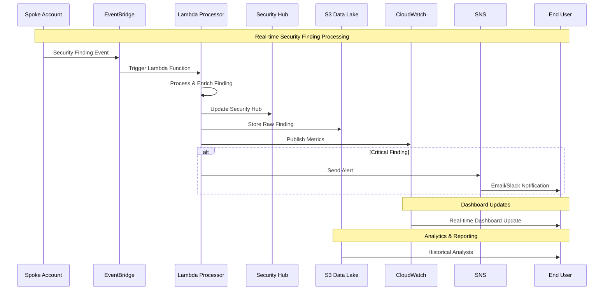
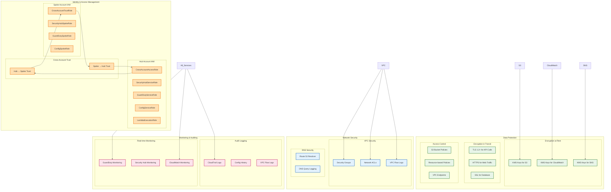
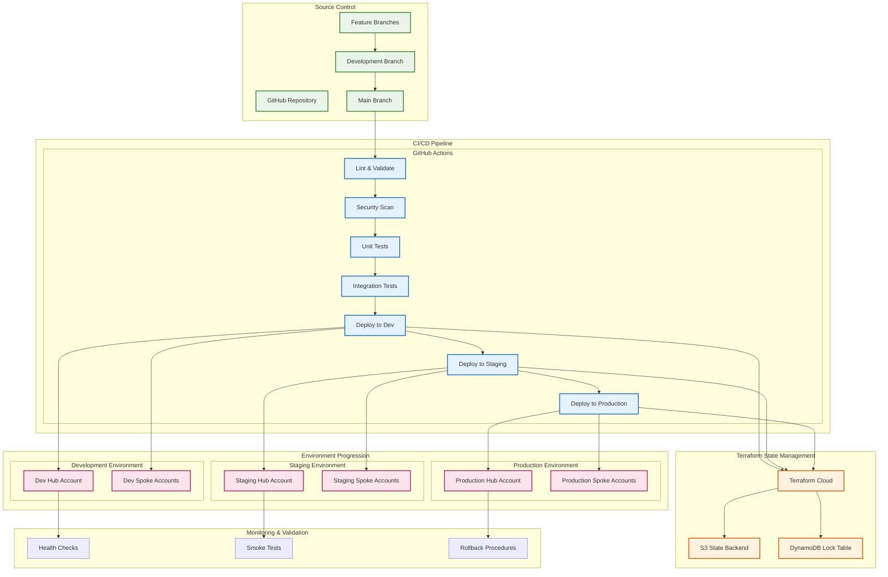
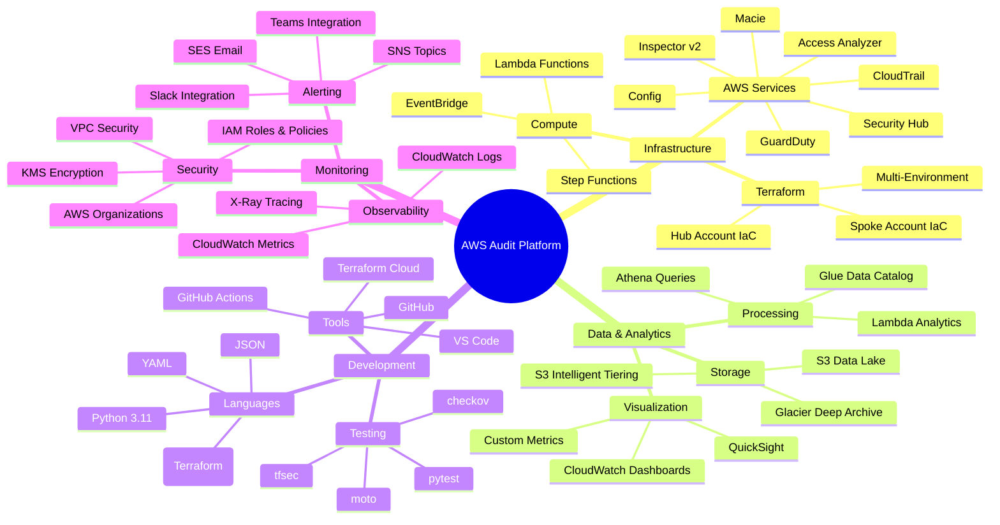

# AWS Audit Platform - Architecture Diagram

## System Architecture Overview

```mermaid
graph TB
    %% External Users
    subgraph "Users & Interfaces"
        EU[Executive Users]
        OU[Operations Users]
        SU[Security Users]
        AU[Audit Users]
    end

    %% Hub Account (Security Command Center)
    subgraph "Hub Account - Security Command Center"
        subgraph "Data Ingestion Layer"
            EB[EventBridge Custom Bus]
            CR[CloudWatch Events Rules]
        end
        
        subgraph "Processing Layer"
            LF1[Security Findings Processor]
            LF2[Dashboard Generator]
            LF3[Cost Analyzer]
            LF4[Compliance Reporter]
        end
        
        subgraph "Security Services Hub"
            SH[Security Hub Master]
            GD[GuardDuty Master]
            CF[Config Aggregator]
            AA[Access Analyzer]
            CT[CloudTrail Organization]
        end
        
        subgraph "Data Layer"
            S3DL[S3 Data Lake]
            S3B[S3 Backup Bucket]
            KMS[KMS Keys]
        end
        
        subgraph "Monitoring & Alerting"
            CWD[CloudWatch Dashboards]
            CWA[CloudWatch Alarms]
            SNS[SNS Topics]
            SES[SES Email Service]
        end
        
        subgraph "Analytics & Reporting"
            QS[QuickSight Dashboards]
            AT[Athena Queries]
            GL[Glue Data Catalog]
        end
    end

    %% Spoke Accounts
    subgraph "Spoke Account 1 - Production"
        subgraph "Security Services"
            SH1[Security Hub]
            GD1[GuardDuty]
            CF1[Config]
            AA1[Access Analyzer]
            IN1[Inspector v2]
            MC1[Macie]
            CT1[CloudTrail]
        end
        
        subgraph "Resources Being Monitored"
            EC2_1[EC2 Instances]
            S3_1[S3 Buckets]
            RDS_1[RDS Databases]
            IAM_1[IAM Resources]
            VPC_1[VPC Resources]
            LAM_1[Lambda Functions]
        end
    end

    subgraph "Spoke Account 2 - Development"
        subgraph "Security Services"
            SH2[Security Hub]
            GD2[GuardDuty]
            CF2[Config]
            AA2[Access Analyzer]
            IN2[Inspector v2]
            CT2[CloudTrail]
        end
        
        subgraph "Resources Being Monitored"
            EC2_2[EC2 Instances]
            S3_2[S3 Buckets]
            IAM_2[IAM Resources]
            VPC_2[VPC Resources]
        end
    end

    subgraph "Spoke Account N - ..."
        SHN[Security Hub]
        GDN[GuardDuty]
        CFN[Config]
        AAN[Access Analyzer]
        INN[Inspector v2]
        MCN[Macie]
        CTN[CloudTrail]
    end

    %% External Integrations
    subgraph "External Integrations"
        SLACK[Slack Notifications]
        TEAMS[Teams Notifications]
        SIEM[External SIEM]
        JIRA[Jira Ticketing]
    end

    %% CI/CD Pipeline
    subgraph "CI/CD Pipeline"
        GH[GitHub Repository]
        GA[GitHub Actions]
        TF[Terraform Cloud]
    end

    %% Data Flow Connections
    SH1 -->|Security Findings| EB
    GD1 -->|Threat Intelligence| EB
    CF1 -->|Compliance Data| EB
    AA1 -->|Access Analysis| EB
    IN1 -->|Vulnerability Data| EB
    MC1 -->|Data Classification| EB
    CT1 -->|Audit Logs| EB

    SH2 -->|Security Findings| EB
    GD2 -->|Threat Intelligence| EB
    CF2 -->|Compliance Data| EB
    AA2 -->|Access Analysis| EB
    IN2 -->|Vulnerability Data| EB
    CT2 -->|Audit Logs| EB

    SHN -->|Security Findings| EB
    GDN -->|Threat Intelligence| EB
    CFN -->|Compliance Data| EB
    AAN -->|Access Analysis| EB
    INN -->|Vulnerability Data| EB
    MCN -->|Data Classification| EB
    CTN -->|Audit Logs| EB

    %% Event Processing
    EB --> CR
    CR --> LF1
    CR --> LF2
    CR --> LF3
    CR --> LF4

    %% Data Storage
    LF1 --> S3DL
    LF2 --> S3DL
    LF3 --> S3DL
    LF4 --> S3DL

    %% Hub Services
    LF1 --> SH
    LF1 --> GD
    LF1 --> CF
    LF1 --> AA

    %% Monitoring
    LF1 --> CWD
    LF2 --> CWD
    LF3 --> CWD
    LF4 --> CWD

    %% Alerting
    LF1 --> SNS
    LF3 --> SNS
    LF4 --> SNS
    SNS --> SES
    SNS --> SLACK
    SNS --> TEAMS

    %% Analytics
    S3DL --> GL
    GL --> AT
    AT --> QS

    %% User Access
    EU --> QS
    EU --> CWD
    OU --> CWD
    SU --> CWD
    AU --> QS

    %% External Integrations
    SNS --> SIEM
    LF1 --> JIRA

    %% CI/CD
    GH --> GA
    GA --> TF
    TF --> Hub Account
    TF --> "Spoke Account 1"
    TF --> "Spoke Account 2"

    %% Resource Monitoring
    EC2_1 --> SH1
    S3_1 --> MC1
    RDS_1 --> GD1
    IAM_1 --> AA1
    VPC_1 --> CF1
    LAM_1 --> IN1

    EC2_2 --> SH2
    S3_2 --> GD2
    IAM_2 --> AA2
    VPC_2 --> CF2

    %% Styling
    classDef hubAccount fill:#ff9999,stroke:#333,stroke-width:2px
    classDef spokeAccount fill:#99ccff,stroke:#333,stroke-width:2px
    classDef processing fill:#99ff99,stroke:#333,stroke-width:2px
    classDef data fill:#ffcc99,stroke:#333,stroke-width:2px
    classDef external fill:#cc99ff,stroke:#333,stroke-width:2px

    class "Hub Account - Security Command Center" hubAccount
    class "Spoke Account 1 - Production","Spoke Account 2 - Development","Spoke Account N - ..." spokeAccount
    class LF1,LF2,LF3,LF4 processing
    class S3DL,S3B,KMS data
    class SLACK,TEAMS,SIEM,JIRA external
```

## Network Architecture

```mermaid
graph TB
    subgraph "AWS Organizations"
        subgraph "Security OU"
            subgraph "Hub Account VPC"
                subgraph "Private Subnets"
                    LF[Lambda Functions]
                    VE[VPC Endpoints]
                end
                subgraph "Public Subnets"
                    NG[NAT Gateway]
                    ALB[Application Load Balancer]
                end
            end
        end
        
        subgraph "Production OU"
            subgraph "Prod Account 1 VPC"
                subgraph "Private Subnets - Prod"
                    APP1[Application Resources]
                    DB1[Database Resources]
                end
                subgraph "Public Subnets - Prod"
                    WEB1[Web Tier]
                end
            end
        end
        
        subgraph "Development OU"
            subgraph "Dev Account VPC"
                subgraph "Private Subnets - Dev"
                    APP2[Application Resources]
                    DB2[Database Resources]
                end
            end
        end
    end

    subgraph "AWS Services"
        S3[S3 Service]
        SH[Security Hub]
        GD[GuardDuty]
        CF[Config]
    end

    %% Network Connections
    LF <--> VE
    VE <--> S3
    VE <--> SH
    VE <--> GD
    VE <--> CF
    
    APP1 --> VE
    DB1 --> VE
    WEB1 --> NG
    
    APP2 --> VE
    DB2 --> VE

    %% Styling
    classDef vpc fill:#e1f5fe,stroke:#01579b,stroke-width:2px
    classDef subnet fill:#f3e5f5,stroke:#4a148c,stroke-width:1px
    classDef service fill:#fff3e0,stroke:#e65100,stroke-width:2px

    class "Hub Account VPC","Prod Account 1 VPC","Dev Account VPC" vpc
    class "Private Subnets","Public Subnets","Private Subnets - Prod","Public Subnets - Prod","Private Subnets - Dev" subnet
    class S3,SH,GD,CF service
```

## Data Flow Architecture



## Security Architecture



## Deployment Architecture



## Cost Architecture

```mermaid
graph TB
    subgraph "Cost Components"
        subgraph "AWS Security Services"
            C_SH[Security Hub: $3,000/month]
            C_GD[GuardDuty: $15,000/month]
            C_CF[Config: $8,000/month]
            C_IN[Inspector: $5,000/month]
            C_MC[Macie: $2,000/month]
            C_CT[CloudTrail: $2,000/month]
        end
        
        subgraph "Compute & Storage"
            C_LF[Lambda: $1,000/month]
            C_S3[S3 Storage: $1,500/month]
            C_CW[CloudWatch: $500/month]
        end
        
        subgraph "Data Transfer"
            C_DT[Data Transfer: $500/month]
            C_VE[VPC Endpoints: $200/month]
        end
    end

    subgraph "Cost Optimization"
        subgraph "Automated Optimization"
            OPT1[S3 Intelligent Tiering]
            OPT2[Lambda Reserved Concurrency]
            OPT3[CloudWatch Log Retention]
            OPT4[Config Rule Optimization]
        end
        
        subgraph "Cost Monitoring"
            MON1[Daily Cost Analysis]
            MON2[Anomaly Detection]
            MON3[Budget Alerts]
            MON4[Forecast Analysis]
        end
    end

    subgraph "Total Cost Summary"
        TOTAL[Total: $36,000/month for 1000 accounts]
        PER_ACCOUNT[Cost per Account: $36/month]
        OPTIMIZATION[Potential Savings: 20-30%]
    end

    %% Cost Flow
    C_SH --> TOTAL
    C_GD --> TOTAL
    C_CF --> TOTAL
    C_IN --> TOTAL
    C_MC --> TOTAL
    C_CT --> TOTAL
    C_LF --> TOTAL
    C_S3 --> TOTAL
    C_CW --> TOTAL
    C_DT --> TOTAL
    C_VE --> TOTAL

    %% Optimization Flow
    OPT1 --> C_S3
    OPT2 --> C_LF
    OPT3 --> C_CW
    OPT4 --> C_CF

    %% Monitoring Flow
    MON1 --> OPTIMIZATION
    MON2 --> OPTIMIZATION
    MON3 --> OPTIMIZATION
    MON4 --> OPTIMIZATION

    %% Styling
    classDef cost fill:#ffebee,stroke:#c62828,stroke-width:2px
    classDef optimization fill:#e8f5e8,stroke:#2e7d32,stroke-width:2px
    classDef summary fill:#e3f2fd,stroke:#1565c0,stroke-width:2px

    class C_SH,C_GD,C_CF,C_IN,C_MC,C_CT,C_LF,C_S3,C_CW,C_DT,C_VE cost
    class OPT1,OPT2,OPT3,OPT4,MON1,MON2,MON3,MON4 optimization
    class TOTAL,PER_ACCOUNT,OPTIMIZATION summary
```



## Technology Stack



---

## Architecture Decision Records (ADRs)

### ADR-001: Hub-and-Spoke Architecture
**Decision**: Implement centralized hub account with distributed spoke accounts  
**Rationale**: Provides centralized visibility while maintaining account isolation  
**Consequences**: Simplified management, better compliance, potential single point of failure  

### ADR-002: Event-Driven Processing
**Decision**: Use EventBridge and Lambda for real-time processing  
**Rationale**: Scalable, cost-effective, and provides near real-time processing  
**Consequences**: Better responsiveness, complexity in error handling  

### ADR-003: S3 Data Lake Architecture
**Decision**: Store all security findings in S3 with structured partitioning  
**Rationale**: Cost-effective storage, enables analytics, supports compliance retention  
**Consequences**: Complex data management, powerful analytics capabilities  

### ADR-004: Multi-Environment Strategy
**Decision**: Separate dev, staging, and production environments  
**Rationale**: Safe deployment practices, testing isolation, production stability  
**Consequences**: Increased infrastructure complexity, better quality assurance  

---

**Architecture Documentation Version**: 2.0  
**Last Updated**: August 27, 2025  
**Next Review**: November 27, 2025  
**Architecture Owner**: Security Engineering Team
